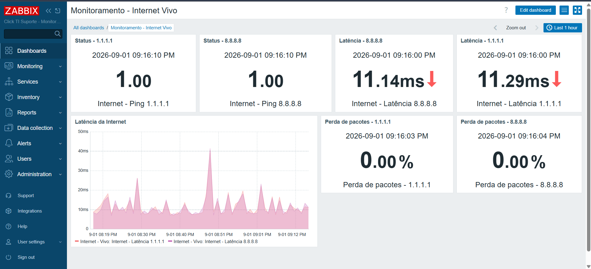

# Laboratório de Monitoramento de Infraestrutura com Zabbix

## 📌 Sobre o projeto

Este projeto apresenta a implementação de um laboratório de monitoramento de infraestrutura utilizando Zabbix em ambiente Linux.

O objetivo é estudar e aplicar conceitos de monitoramento, disponibilidade, desempenho, redes e alertas, simulando uma estrutura utilizada em ambientes corporativos.

## 🎯 Objetivos

- Monitorar recursos do servidor
- Monitorar disponibilidade da Internet
- Monitorar latência
- Monitorar perda de pacotes
- Criar triggers para eventos críticos
- Configurar notificações por e-mail
- Criar dashboards para visualização dos indicadores

## 🖥️ Monitoramento do servidor

Foram configurados indicadores para acompanhamento de:

- CPU
- Memória RAM
- Disco
- Rede

## 🌐 Monitoramento da Internet

A conectividade com a Internet é monitorada através de dois destinos externos:

- 1.1.1.1
- 8.8.8.8

São monitorados:

- Disponibilidade
- Latência
- Perda de pacotes

## 🚨 Alertas

Foram configurados alertas para situações críticas, incluindo:

- Internet indisponível
- Latência elevada

As notificações são enviadas por e-mail através do sistema de ações do Zabbix.

## 📊 Dashboards

Foram criados dashboards para facilitar a visualização dos indicadores de infraestrutura e conectividade.

## 🏗️ Arquitetura

```text
                 INTERNET
                     │
             ┌───────▼───────┐
             │ Roteador Vivo │
             └───────┬───────┘
                     │
                    Wi-Fi
                     │
             ┌───────▼────────┐
             │ Servidor Linux │
             │    Zabbix      │
             └───────┬────────┘
                     │
             ┌───────┴────────┐
             │                │
          1.1.1.1          8.8.8.8


## Dashboard de Monitoramento

Dashboard criado no Zabbix para monitoramento da conexão de Internet residencial.

### Monitoramentos

- Status de conectividade com 1.1.1.1
- Status de conectividade com 8.8.8.8
- Latência para 1.1.1.1
- Latência para 8.8.8.8
- Gráfico de latência
- Perda de pacotes para 1.1.1.1
- Perda de pacotes para 8.8.8.8

### Dashboard


